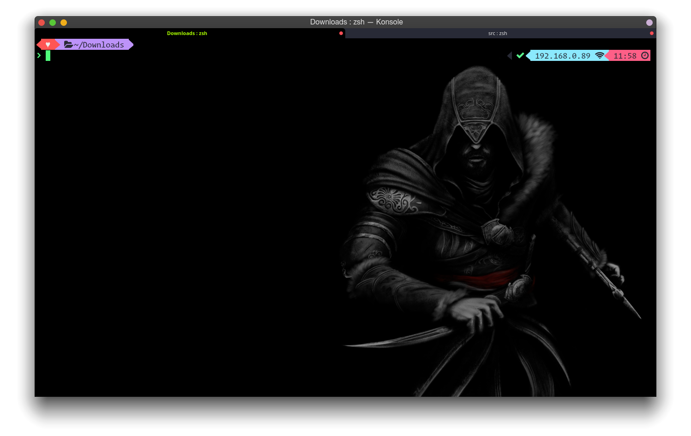
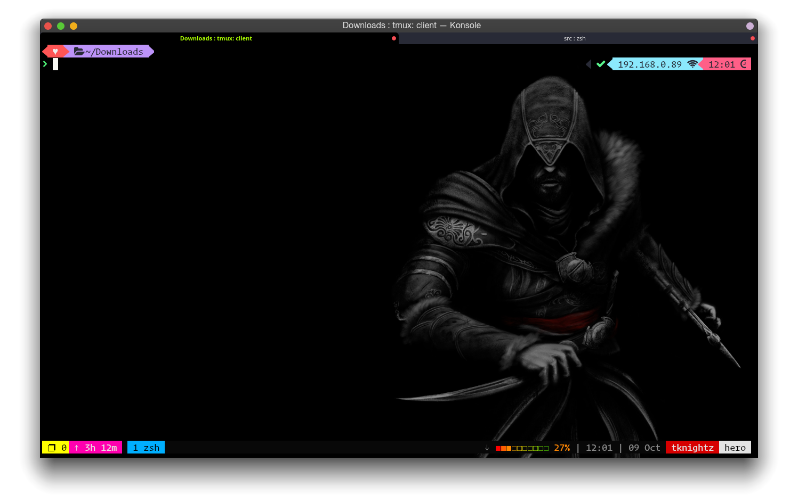
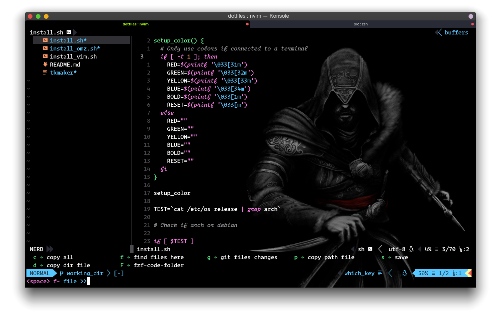
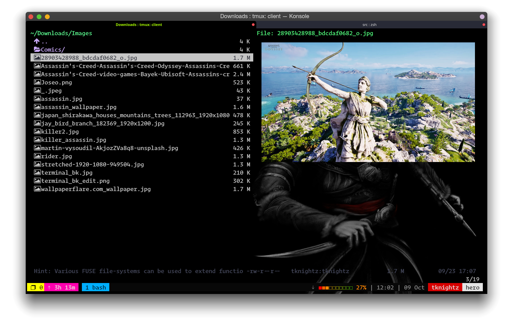

# My personal configuration for nvim, vim, vifm, zsh,...
### Overview
- #### Zsh + Powerlevel9k


- #### Tmux


- #### Nvim


- #### Vifm


> Font : Operator Mono with Ligatures

### Auto-Installation:

- #### Clone my repo
```bash
git clone https://github.com/tknightz/dotfiles.git
cd dotfiles
```

- #### Install all configurations
```bash
./install.sh
```

- #### Install only zsh, ohmyzsh, powerlevel9k
```bash
./install_omz.sh
```

- #### Install only nvim configurations
```bash
chmod +x install_vim
./install_vim.sh
```
Created by **Tuyen Knightz** with a thousand hours configuring.
